# 청년 채무자를 위한 통합 채무 관리 서비스 - 티끌 모아 청산

## 📝 목차

- [프로젝트 소개](#-프로젝트-소개)
- [팀원 구성](#-팀원-구성)
- [개발 기간](#-개발-기간)
- [주요 기능](#-주요-기능)
- [ERD](#-erd)
- [시스템 아키텍처](#-시스템-아키텍처)

## 📄 프로젝트 소개

청년 채무자를 위한 통합 채무 관리 서비스 "티끌 모아 청산"

채무 문제로 어려움을 겪는 사회초년생을 위해, 부채 및 지출 현황을 종합적으로 관리하고 최적의 상환 전략을 제안하는 서비스입니다. 메인 대시보드에서 재무 상태를 시각적으로 보여주고, 상환 시뮬레이터를 통해 맞춤형
상환 계획을 수립하며, 대출 시뮬레이션 및 정책 추천을 통해 건전한 재정 관리를 돕는 것을 목표로 합니다.

## 👨‍👩‍👧‍👦 팀원 구성

|                                  안태현(팀장)                                   |                                    민중원                                     |                                   옥가연                                   |                                   최재원                                   |                                    최화진                                     |                                   하주연                                    |
|:--------------------------------------------------------------------------:|:--------------------------------------------------------------------------:|:-----------------------------------------------------------------------:|:-----------------------------------------------------------------------:|:--------------------------------------------------------------------------:|:------------------------------------------------------------------------:|
|  |  |  |  |  |  |
|                              PM & Full Stack                               |                                 Full Stack                                 |                               Full Stack                                |                               Full Stack                                |                                 Full Stack                                 |                                Full Stack                                |

## 📅 개발 기간

2025.07.09 ~ 2025.08.20

## 🔎 주요 기능

시연 영상 링크: https://youtu.be/5MD61QUolNA

### 메인 대시보드

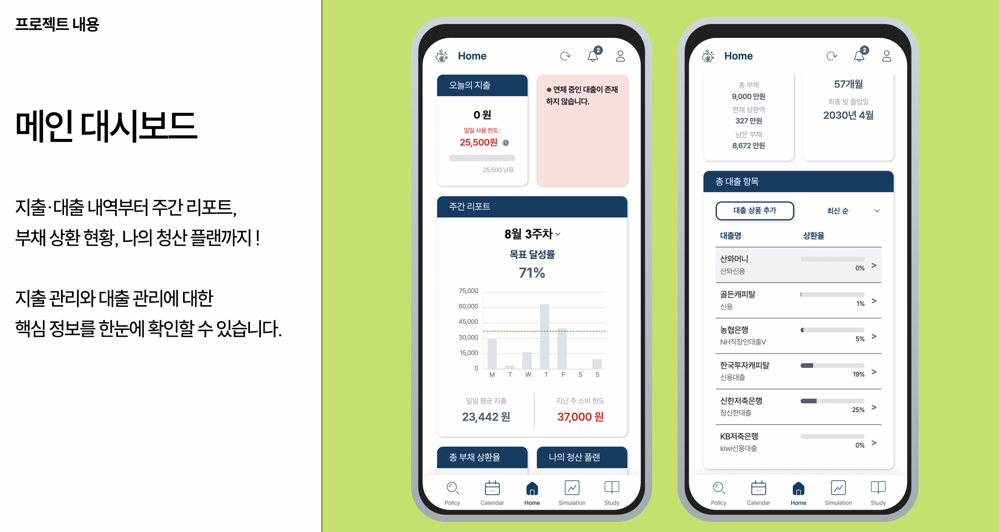
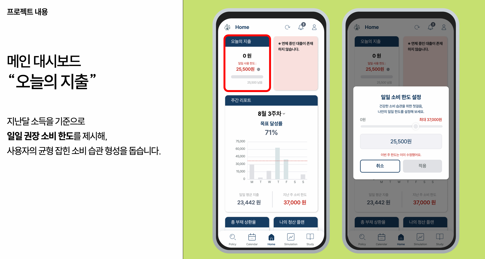
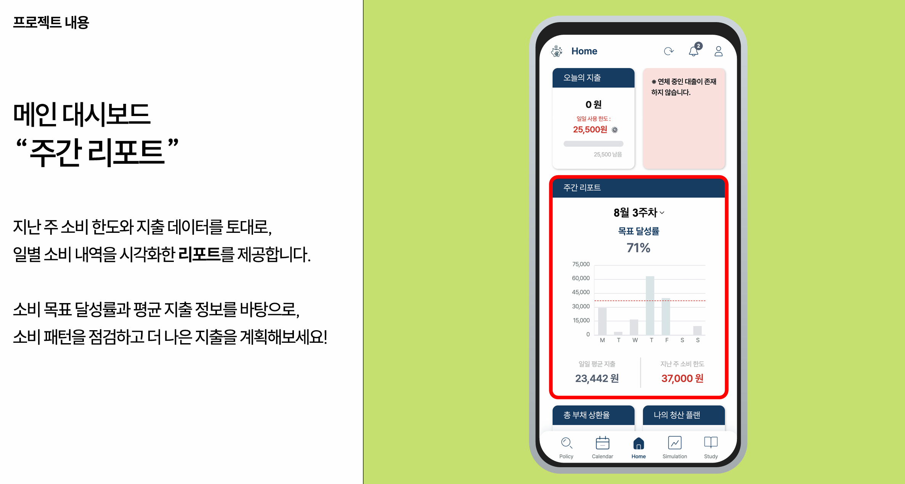
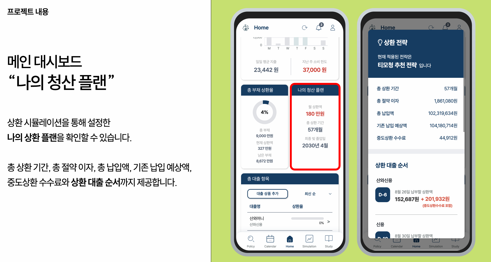
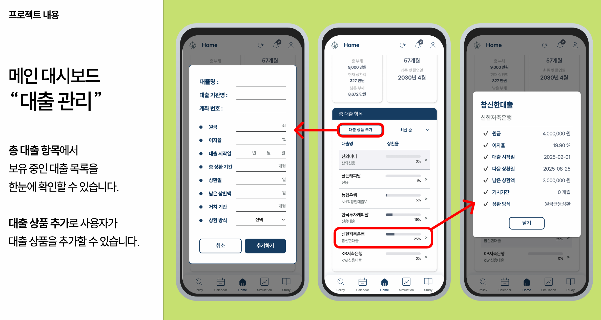

### 상환 및 대출 시뮬레이션

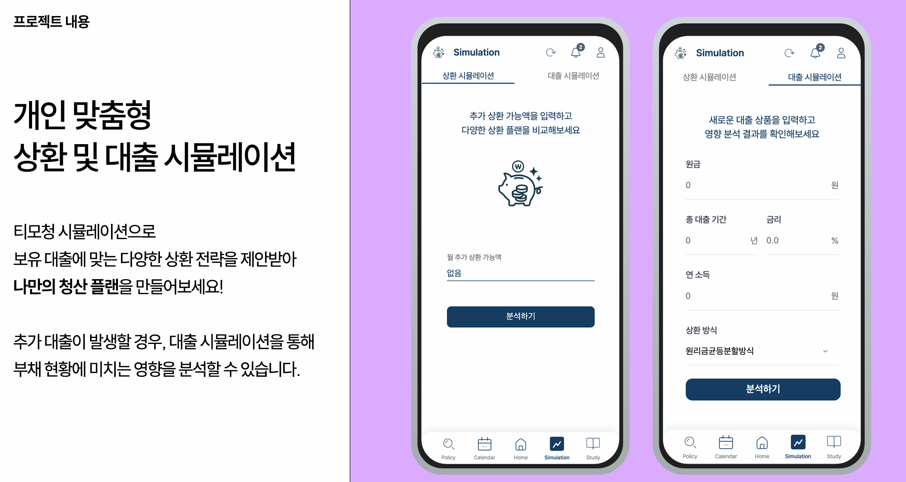
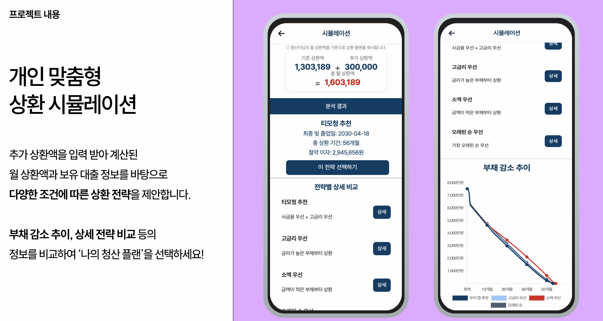
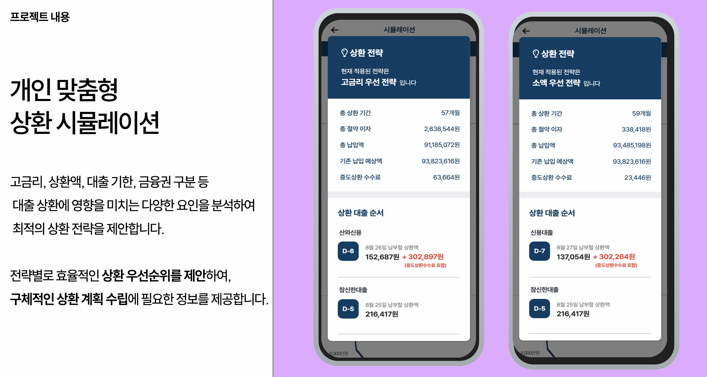
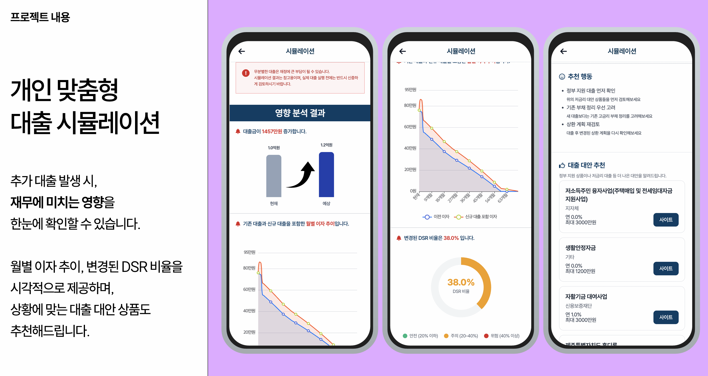

### 캘린더

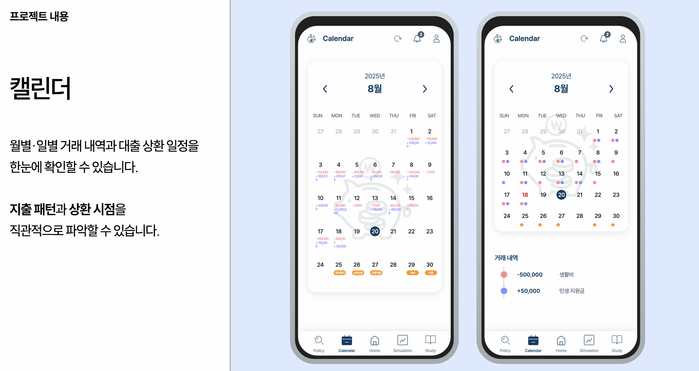

### 마이데이터 갱신 및 실시간 알림

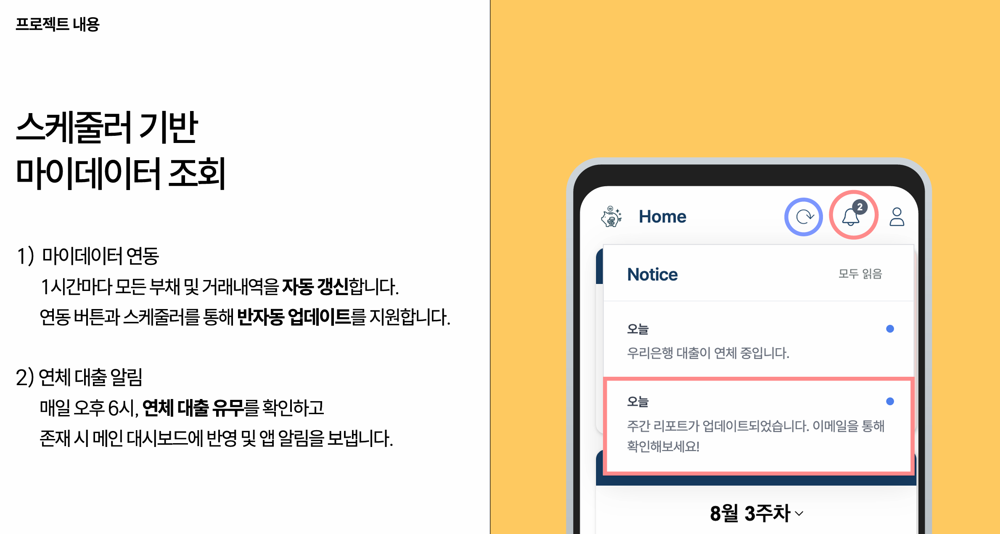
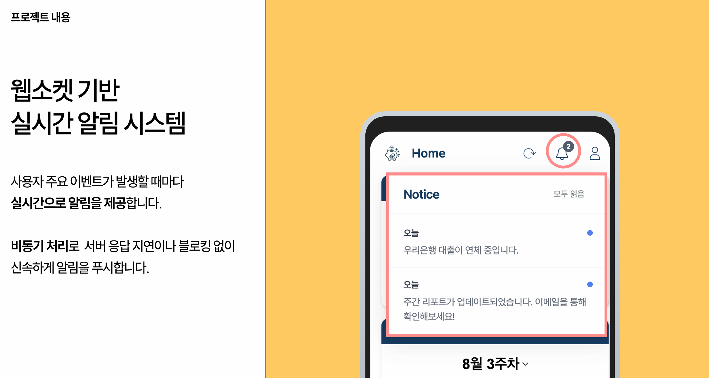

### 정책 페이지

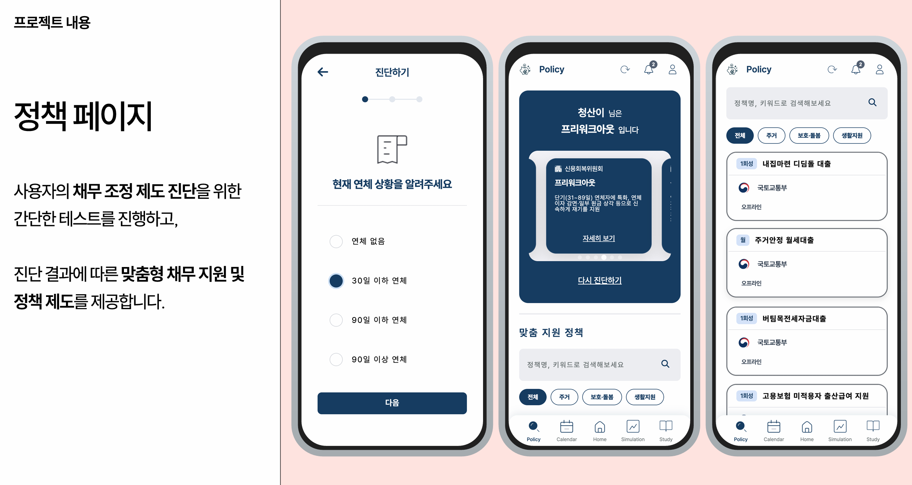

### 금융 학습 컨텐츠

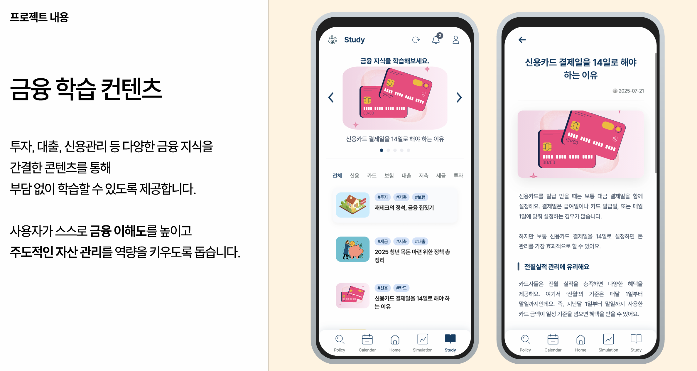

## 📐 ERD

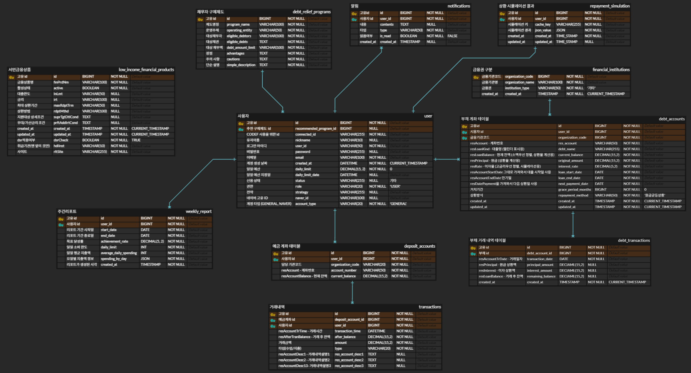

## 🏗 시스템 아키텍처

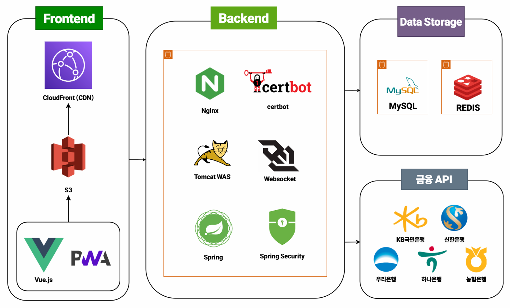
